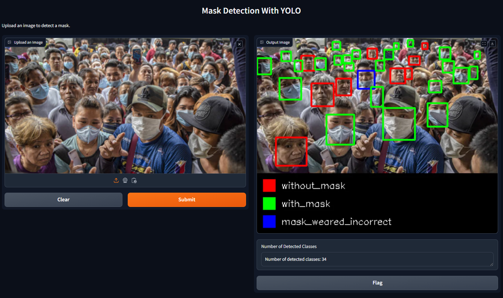
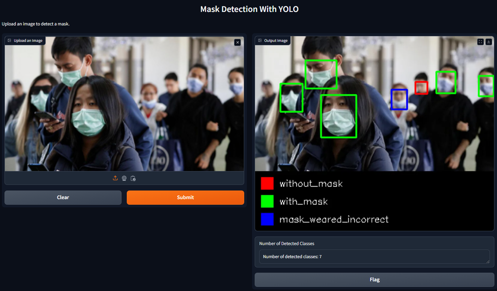

# Mask Detection With YOLO v8

Mask Detection is an AI-powered project that enables users to upload images and receive real-time detection results for masks using the finetuned YOLOv8n model. The project is designed to operate within a Dockerized environment, utilizing FastAPI for efficient backend processing, and features a Gradio interface for a seamless user experience.

## Key Features

- **YOLOv8n Model:** Leverages the YOLOv8n model from Ultralytics, finetuned on a specialized masks dataset, to achieve high-accuracy mask detection in various images.
- **FastAPI Backend:** Implements FastAPI for a fast, robust, and scalable backend, ensuring efficient handling of image uploads and model inference.
- **Dockerized Environment:** Runs in a Docker container, providing an isolated and consistent environment for deployment across different platforms.
- **Gradio Interface:** Features a user-friendly Gradio interface, allowing users to easily upload images and view mask detection results within a web-based application.

## Demo Thumbnail

Below are sample thumbnails of the detected masks in uploaded images:

 

## Installation

1. Clone the repository.
2. Install the required dependencies from the `requirements.txt` file.
3. Build and run the Docker container using the provided `Dockerfile`.

## Usage

1. Start the Docker container with the FastAPI application.
2. Run interface.py to access the Gradio interface through the provided URL.
3. Upload an image via the Gradio interface.
4. View the detected masks in the output window and the number of detected classes.

---

Mask Detection is designed to deliver precise mask detection results by leveraging the powerful, finetuned YOLOv8n model, all within a user-friendly and highly efficient environment.
